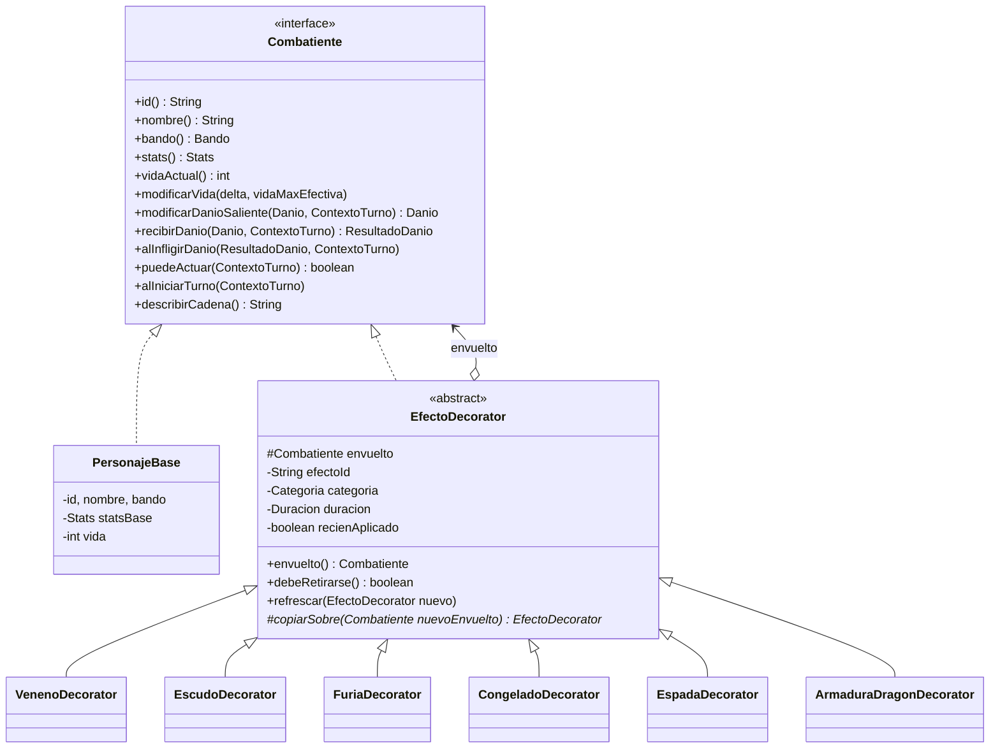

# Diseño — RPG Decorator

> El **cómo** en detalle. Si algo aquí contradice a `requirements.md`, manda `requirements.md` y se reporta en `open-questions.md`.

Índice:
1. Mapa del patrón Decorator
2. Contratos del dominio
3. Trampas del Decorator y cómo las resolvemos
4. Catálogo de efectos, equipo, clases y enemigos
5. Motor de combate
6. Eventos
7. Diseño de la UI

---

## 1. Mapa del patrón Decorator (GoF)

| Rol GoF | Clase | Paquete |
|---|---|---|
| **Component** | `Combatiente` (interfaz) | `dominio` |
| **ConcreteComponent** | `PersonajeBase` | `dominio` |
| **Decorator** | `EfectoDecorator` (abstracta) | `dominio.decorador` |
| **ConcreteDecorator** (temporales) | `VenenoDecorator`, `EscudoDecorator`, `FuriaDecorator`… | `dominio.efectos` |
| **ConcreteDecorator** (permanentes) | `EspadaDecorator`, `ArmaduraDragonDecorator`… | `dominio.equipo` |
| **Client** | `MotorCombate`, `GestorEfectos` | `motor` |



Ejemplo de cadena en memoria (afuera → adentro):

```
heroe ──► FuriaDecorator ──► VenenoDecorator ──► EspadaDecorator ──► PersonajeBase(Guerrero)
          (temporal, 2t)     (temporal, 3t)      (equipo, ∞)         (vida, stats base)
describirCadena() = "Furia(Envenenado(Espada(Guerrero)))"
```

**Invariante de orden:** el equipo siempre queda **por dentro** de los efectos temporales: se aplica al crear el combate, antes de cualquier efecto, y los efectos nuevos se agregan siempre en la capa exterior.

---

## 2. Contratos del dominio

### 2.1 Tipos de valor (records)

```java
record Stats(int vidaMax, int ataque, int defensa, int velocidad, int critico) // critico = % 0..100
    // métodos "con": conAtaque(int), conDefensa(int)... devuelven copias

record Danio(int fisico, int elemental, String origenId, boolean critico, boolean reflejable)
    // fisico: se mitiga con defensa; elemental: NO se mitiga

record ResultadoDanio(int recibido, int absorbido, int reflejado, boolean evadido)
    // recibido = vida realmente perdida; reflejado = daño a devolver al atacante

enum Bando { HEROE, ENEMIGO }
enum Categoria { EQUIPO, BUFF, DEBUFF, CONTROL }   // EQUIPO = permanente, no se purga
record Duracion(int turnos) // PERMANENTE = Integer.MAX_VALUE; decrementar(), expirada()
```

### 2.2 `Combatiente` — semántica de cada método

| Método | `PersonajeBase` | `EfectoDecorator` (por defecto) |
|---|---|---|
| `id()`, `nombre()`, `bando()` | Valores propios | Delega (la identidad es la del base) |
| `stats()` | `statsBase` | Delega. Los decoradores de stats transforman `envuelto.stats()` |
| `vidaActual()` | `vida` | Delega |
| `modificarVida(delta, max)` | `vida = clamp(vida + delta, 0, max)` | Delega. **Ningún decorador lo sobrescribe** |
| `modificarDanioSaliente(d, ctx)` | Devuelve `d` | Delega |
| `recibirDanio(d, ctx)` | Resta `d` a la vida y devuelve el resultado | Delega |
| `alInfligirDanio(r, ctx)` | No hace nada | Delega |
| `puedeActuar(ctx)` | `true` | Delega |
| `alIniciarTurno(ctx)` | No hace nada | **Primero su lógica, luego delega** |
| `describirCadena()` | `nombre` de la clase o enemigo | `etiqueta + "(" + envuelto.describirCadena() + ")"` |

Cada decorador concreto **sobrescribe solo lo que le corresponde** y en todo lo demás delega (lo hereda de `EfectoDecorator`).

### 2.3 `ContextoTurno` (interfaz en `dominio`, implementada por `motor`)

Los decoradores **no mutan la vida directamente**: piden al contexto que lo haga, y el motor lo resuelve con la **cadena exterior** (ver §3.1).

```java
interface ContextoTurno {
    void emitir(EventoCombate evento);
    Aleatorio aleatorio();
    void danioDirecto(String objetivoId, int cantidad, TipoDanio tipo, String fuenteEfectoId); // ignora defensa y escudo
    void curar(String objetivoId, int cantidad, String fuenteEfectoId);
    int ronda();
}
```

> `ContextoTurno`, `Aleatorio` y `EventoCombate` viven en `dominio` (los decoradores los usan); el `motor` los implementa. Esto respeta la regla `motor → dominio`.

### 2.4 `EfectoDecorator`

```java
abstract class EfectoDecorator implements Combatiente {
    protected final Combatiente envuelto;
    private final String efectoId;       // "veneno", "espada"...
    private final String etiqueta;       // "Envenenado", "Espada"
    private final Categoria categoria;
    private Duracion duracion;
    private boolean recienAplicado = true;

    // ... delegación de TODOS los métodos de Combatiente ...

    public Combatiente envuelto();
    public boolean debeRetirarse()      { return duracion.expirada(); }   // Escudo: || absorcion == 0
    public void refrescar(EfectoDecorator nuevo) { this.duracion = nuevo.duracion; } // Escudo: suma absorción
    public void avanzarTurno()           { if (recienAplicado) recienAplicado = false; else duracion = duracion.decrementar(); }

    /** Crea una copia de este decorador (con su estado: duración, absorción...) envolviendo a otro combatiente. */
    protected abstract EfectoDecorator copiarSobre(Combatiente nuevoEnvuelto);
}
```

---

## 3. Trampas del Decorator y cómo las resolvemos

> Esta sección es **el corazón didáctico** del proyecto. Cada trampa tiene su test (T-108).

### 3.1 Llamadas a sí mismo (*self-calls*) ignoran los decoradores
`PersonajeBase` no sabe que está decorado: si dentro de sí mismo usara `this.stats().defensa()`, vería la defensa **sin** la Armadura.
**Solución:** todo cálculo que necesita stats efectivas lo hace **el motor sobre la referencia exterior**:
- La mitigación por defensa la calcula `MotorCombate` con `objetivo.stats()` **antes** de llamar a `recibirDanio`.
- La vida máxima efectiva se pasa como parámetro: `modificarVida(delta, exterior.stats().vidaMax())`.
- Los decoradores curan o dañan vía `ContextoTurno`, que resuelve la cadena exterior por `id`.

### 3.2 Quitar un decorador del medio
Las referencias `envuelto` son `final`; no se puede "desenganchar" una capa.
**Solución (ADR-002):** `GestorEfectos` **reconstruye** la cadena:
1. Desenrolla de afuera hacia adentro: `[Furia, Veneno, Espada]` + `base`.
2. Filtra las capas a retirar → `[Furia, Espada]`.
3. Reenvuelve de adentro hacia afuera con `copiarSobre`: `base → Espada' → Furia'`.
4. Devuelve la nueva referencia exterior; `Combate` la reemplaza.

El `PersonajeBase` es **la misma instancia**, así que la vida se conserva. Las capas copiadas conservan su estado (turnos, absorción).

### 3.3 `instanceof` deja de funcionar
`heroe instanceof CongeladoDecorator` solo ve la capa exterior.
**Solución:** `GestorEfectos.tieneEfecto(c, "congelado")` y `GestorEfectos.capas(c)` recorren la cadena. Nadie fuera de `GestorEfectos` hace `instanceof` sobre decoradores.

### 3.4 El orden importa
`Furia(Espada(base))`: ataque = (14 + 6) × 1.5 = **30**.
`Espada(Furia(base))`: ataque = 14 × 1.5 + 6 = **27**.
**Solución:** el orden lo fija la invariante del §1 (equipo dentro, efectos fuera, en orden de aplicación). El inspector muestra las **stats en cada capa** para que se vea.

### 3.5 Duplicados
Aplicar dos veces Veneno crearía `Veneno(Veneno(...))` y doble daño.
**Solución:** `GestorEfectos.aplicar` busca el `efectoId` en la cadena; si ya existe, llama a `refrescar` (RF-16) y emite `EFECTO_REFRESCADO`.

### 3.6 Identidad
`equals`/`id` entre capas: todas las capas devuelven el `id()` del base. Los repositorios y el contexto buscan por `id`, nunca por referencia.

---

## 4. Catálogos

### 4.1 Fórmulas
- **Daño bruto:** `round(atacante.stats().ataque() × multiplicador)`. Atacar normal: multiplicador 1.0.
- **Crítico:** con probabilidad `critico %` → bruto × 1.5 (redondeo hacia abajo).
- **Danio saliente:** `atacante.modificarDanioSaliente(new Danio(bruto, 0, …))` (el AnilloFuego suma elemental aquí).
- **Evasión:** probabilidad `min(25, objetivo.velocidad × 2) %` → evento `EVASION`, sin daño.
- **Mitigación:** `fisico' = max(1, fisico − objetivo.stats().defensa() / 2)`; `elemental` no se mitiga.
- Luego `objetivo.recibirDanio(danioMitigado)` → `ResultadoDanio`.
- Si `reflejado > 0` → `ctx.danioDirecto(atacante, reflejado, REFLEJADO)`; el daño reflejado **no** se vuelve a reflejar.
- Finalmente `atacante.alInfligirDanio(resultado)` (Vampirismo).
- Todos los porcentajes se redondean hacia abajo; los efectos que curan o dañan lo hacen con un mínimo de 1 si su base es > 0.

### 4.2 Efectos temporales (`CatalogoEfectos`)

| id | Etiqueta | Categoría | Duración | Comportamiento (método sobrescrito) |
|---|---|---|---|---|
| `veneno` | Envenenado | DEBUFF | 3 | `alIniciarTurno`: `danioDirecto(6, VENENO)` |
| `regeneracion` | Regeneración | BUFF | 3 | `alIniciarTurno`: `curar(8)` |
| `escudo` | Escudo | BUFF | 3 | `recibirDanio`: absorbe hasta `absorcion` (20) y delega el resto. Se retira si `absorcion == 0` |
| `espinas` | Espinas | BUFF | 3 | `recibirDanio`: delega y pone `reflejado = 30 %` de `recibido` (si `danio.reflejable`) |
| `furia` | Furia | BUFF | 2 | `stats()`: ataque × 1.5, defensa × 0.7 |
| `defensa` | En guardia | BUFF | 1 | `stats()`: defensa × 1.5 |
| `congelado` | Congelado | CONTROL | 1 | `puedeActuar()`: `false` (no delega) |
| `vampirismo` | Vampirismo | BUFF | 3 | `alInfligirDanio`: `curar(30 % de recibido)` |

**Silencio** **no es un decorador**: es una **operación sobre la cadena** (`GestorEfectos.purgar`) que retira todas las capas con categoría ≠ `EQUIPO`. Es un buen ejemplo de qué *no* modelar como decorador.

### 4.3 Reaplicación (RF-16)
- Por defecto: la duración se **resetea** al valor del nuevo efecto.
- `escudo`: suma la absorción (`min(40, actual + 20)`) y resetea la duración.

### 4.4 Reglas de interacción (`ReglasInteraccion`, RF-17)
Se evalúan **antes** de aplicar el efecto nuevo:

| Al aplicar | Se retira | Motivo |
|---|---|---|
| `congelado` | `furia` | No se puede estar furioso congelado |
| `furia` | `defensa` | La furia rompe la guardia |
| `veneno` | `regeneracion` | Se anulan |
| `regeneracion` | `veneno` | Se anulan |

Las reglas son **datos** (una tabla `Map<String, Set<String>>`), no `if` dispersos: agregar una regla no toca el motor (RNF-03).

### 4.5 Duración y "recién aplicado"
- La duración cuenta **turnos del combatiente afectado**.
- `GestorEfectos.avanzarTurno(c)` se llama al **final del turno** del afectado: decrementa la duración de cada capa y luego retira las que `debeRetirarse()`.
- Un efecto aplicado **durante el propio turno del afectado** (p. ej., Furia sobre uno mismo) no decrementa ese turno (`recienAplicado`), así dura N turnos completos.
- Ejemplo: Veneno (3) aplicado por el enemigo → el héroe recibe daño al inicio de sus 3 turnos siguientes y luego se retira.

### 4.6 Equipo (`CatalogoEquipo`) — decoradores permanentes

| id | Nombre | Ranura | Efecto |
|---|---|---|---|
| `espada` | Espada | ARMA | ataque +6 |
| `hacha` | Hacha de guerra | ARMA | ataque +10, velocidad −3 |
| `baston` | Bastón rúnico | ARMA | ataque +3, crítico +15 |
| `armadura_cuero` | Armadura de cuero | ARMADURA | defensa +4 |
| `armadura_dragon` | Armadura de dragón | ARMADURA | defensa +10, velocidad −4 |
| `anillo_fuego` | Anillo de fuego | ACCESORIO | `modificarDanioSaliente`: elemental +4 |
| `amuleto_vida` | Amuleto de vida | ACCESORIO | vidaMax +25 |
| `botas_viento` | Botas de viento | ACCESORIO | velocidad +5 |

Máximo una pieza por ranura (RF-03). Las stats nunca bajan de 0 (crítico tope 100).

### 4.7 Clases de héroe (`CatalogoClases`)

| Clase | Vida | Atq | Def | Vel | Crít | Habilidad 1 | Habilidad 2 |
|---|---|---|---|---|---|---|---|
| Guerrero | 120 | 14 | 8 | 4 | 10 | **Grito de guerra**: Furia a sí mismo (cd 3) | **Muro de escudos**: Escudo a sí mismo (cd 3) |
| Mago | 80 | 18 | 4 | 6 | 10 | **Rayo de hielo**: daño ×0.8 + Congelado al rival (cd 4) | **Silencio arcano**: purga al rival (cd 4) |
| Arquero | 95 | 15 | 5 | 10 | 20 | **Flecha envenenada**: daño ×0.7 + Veneno al rival (cd 3) | **Flecha vampírica**: Vampirismo a sí mismo + daño ×1.0 (cd 4) |

```java
record Habilidad(String id, String nombre, String descripcion, int enfriamiento,
                 double multiplicadorDanio,              // 0 = no ataca
                 List<AplicacionEfecto> efectos,         // (efectoId, Objetivo.PROPIO | RIVAL)
                 boolean purgaRival)                     // Silencio
```
Orden de resolución de una habilidad: 1) efectos sobre uno mismo, 2) daño (si el multiplicador es > 0), 3) efectos sobre el rival (solo si el golpe no fue evadido), 4) purga.

### 4.8 Enemigos (`CatalogoEnemigos`) e IA

| Nivel | Enemigo | Vida | Atq | Def | Vel | Crít | Habilidades (en orden de prioridad) |
|---|---|---|---|---|---|---|---|
| 1 | Goblin | 70 | 11 | 3 | 8 | 10 | **Daga sucia**: daño ×0.8 + Veneno al rival (cd 3; 50 % de probabilidad si está lista) |
| 1 | Lobo | 60 | 12 | 2 | 12 | 15 | **Aullido**: Furia propia (cd 4; si vida < 60 %) |
| 1 | Slime | 90 | 8 | 4 | 2 | 0 | **Gelatina**: Escudo propio (cd 4) · **Ácido**: daño ×0.5 + Veneno (cd 3) |
| 2 | Esqueleto | 100 | 13 | 7 | 3 | 5 | **Reensamblar**: Regeneración propia (cd 5; si vida < 50 %) · **Huesos afilados**: Espinas propias (cd 4) |
| 2 | Orco chamán | 110 | 14 | 6 | 5 | 10 | **Maldición**: purga al rival (cd 5; si el rival tiene ≥ 2 efectos BUFF) · **Tótem de sangre**: Vampirismo propio (cd 4) |
| 3 | Golem de piedra | 160 | 15 | 14 | 1 | 0 | **Piel de piedra**: Espinas propias (cd 4) · **Pisotón**: daño ×1.0 + Congelado (cd 5) |
| 3 | Bruja | 90 | 16 | 4 | 7 | 15 | **Pócima**: Regeneración propia (cd 4; si vida < 50 %) · **Hechizo gélido**: Congelado al rival (cd 4) · **Maleficio**: Veneno al rival (cd 3) |
| 4 (jefe) | Dragón | 200 | 17 | 9 | 5 | 10 | **Escamas**: Escudo propio (cd 5; si vida < 40 %) · **Aliento helado**: daño ×0.6 + Congelado (cd 5) · **Rugido**: Furia propia (cd 4) |

Cada enemigo **demuestra decoradores distintos**, así la expedición recorre todo el catálogo de efectos.

**IA (`IaEnemigo`):** recorre las habilidades en orden de prioridad; usa la primera que tenga enfriamiento 0 **y** cumpla su condición. Si ninguna aplica → `Atacar`. Determinista salvo por las probabilidades, que usan `Aleatorio`.

---

## 5. Motor de combate

### 5.1 Agregado `Combate`
```
Combate { id, semilla, estado, ronda,
          Combatiente heroe, Combatiente enemigo,            // referencias EXTERIORES
          Map<String,Integer> enfriamientosHeroe, enfriamientosEnemigo,
          List<EventoCombate> log, int secuenciaEventos }
```
Toda mutación de un combate ocurre dentro de `synchronized (combate)`.

### 5.2 Acciones
```java
sealed interface Accion permits Atacar, Defender, UsarHabilidad, Pasar {}
```
- `Defender` → aplica `defensa` a sí mismo.
- `Pasar` → solo es válida si el héroe **no** puede actuar (Congelado); la UI la ofrece en ese caso.
- Validaciones → `AccionInvalidaException` (habilidad inexistente, en enfriamiento, combate terminado).

### 5.3 Algoritmo de una ronda (`MotorCombate.ejecutarRonda`)
```
ejecutarRonda(combate, accionHeroe):
    validar(combate, accionHeroe)
    turno(HEROE, accionHeroe)
    si enemigo.vida == 0 → terminar(VICTORIA); return
    turno(ENEMIGO, ia.decidir(combate))
    si heroe.vida == 0 → terminar(DERROTA); return
    combate.ronda++

turno(actor, accion):
    emitir TURNO_INICIADO
    decrementar enfriamientos > 0 del actor
    actor.alIniciarTurno(ctx)                 # Veneno, Regeneración
    si actor.vida == 0 → emitir MUERTE; return
    si !actor.puedeActuar(ctx) → emitir TURNO_PERDIDO
    sino → resolver(accion)                   # §4.1 y §4.7; pone el enfriamiento de la habilidad usada
    actor = gestor.avanzarTurno(actor)        # duraciones; retira expirados → EFECTO_RETIRADO
    emitir TURNO_TERMINADO
```
> La referencia exterior del actor **puede cambiar** durante el turno (al aplicar o retirar capas): el motor siempre relee `combate.heroe()` / `combate.enemigo()` después de cada operación del gestor.

### 5.4 `GestorEfectos` — API

```java
Combatiente aplicar(Combatiente exterior, String efectoId, ContextoTurno ctx);   // reglas → refrescar o envolver
Combatiente retirar(Combatiente exterior, Predicate<EfectoDecorator> filtro, MotivoRetiro motivo, ContextoTurno ctx);
Combatiente avanzarTurno(Combatiente exterior, ContextoTurno ctx);              // decrementa + retira (EXPIRADO/AGOTADO)
Combatiente purgar(Combatiente exterior, ContextoTurno ctx);                    // Silencio
Combatiente equipar(Combatiente base, List<String> equipoIds);                  // solo al crear
boolean tieneEfecto(Combatiente exterior, String efectoId);
List<Capa> capas(Combatiente exterior);   // afuera → adentro, con stats efectivas en cada capa
```

### 5.5 Expedición (`Expedicion`, `ServicioExpedicion`)

```
Expedicion { id, semilla, claseId, estado: EN_CURSO | ESPERANDO_RECOMPENSA | COMPLETADA | FRACASADA,
             nivelActual (1..4), List<String> enemigosPorNivel,     // sorteados al crear
             PersonajeBase heroeBase,                               // la MISMA instancia en todos los encuentros
             Map<Ranura, String> equipo,                            // piezas actuales
             Combate combateActual, List<String> recompensasOfrecidas,
             Estadisticas estadisticas }                            // vencidos, rondas, daño infligido y recibido
```

Ciclo de vida:
```
crear(claseId, equipoInicialId, semilla?)
   → sortea los enemigos de cada nivel con Aleatorio(semilla)
   → heroeBase = PersonajeBase(clase); vida = vidaMax efectiva con el equipo
   → iniciarEncuentro(1)

iniciarEncuentro(n):
   heroe   = gestor.equipar(heroeBase, equipo)      # cadena NUEVA: solo equipo, sin efectos
   enemigo = PersonajeBase(enemigosPorNivel[n])
   combateActual = new Combate(heroe, enemigo)

al terminar combateActual:
   DERROTA  → estado = FRACASADA
   VICTORIA y n == 4 → estado = COMPLETADA
   VICTORIA y n < 4  → curar 30 % de la vidaMax efectiva (RF-24)
                       recompensasOfrecidas = 3 piezas al azar, distintas, no equipadas
                       estado = ESPERANDO_RECOMPENSA

elegirRecompensa(piezaId | null):
   si piezaId → equipo[ranura(pieza)] = piezaId     # reemplaza
   nivelActual++ ; iniciarEncuentro(nivelActual) ; estado = EN_CURSO
```

> **Por qué así se purgan los efectos (RF-24):** al iniciar cada encuentro se **reconstruye la cadena desde el `PersonajeBase`** solo con el equipo. Los efectos temporales del encuentro anterior simplemente no se vuelven a envolver. El base (y por tanto la vida) es la misma instancia.

---

## 6. Eventos (`EventoCombate`, sealed)

Todo evento tiene `seq` (incremental por combate), `ronda` y `tipo`. Campos específicos:

| tipo | Campos | Animación en la UI |
|---|---|---|
| `TURNO_INICIADO` | `actorId` | Resalta la tarjeta del actor |
| `ACCION` | `actorId`, `accion`, `habilidadId?` | Texto "¡Grito de guerra!" sobre el actor |
| `DANIO` | `objetivoId`, `cantidad`, `tipoDanio` (FISICO, ELEMENTAL, VENENO, REFLEJADO), `critico` | Número rojo flotante + sacudida (morado si es veneno, naranja si es elemental) |
| `EVASION` | `objetivoId` | Texto "¡Esquivó!" + desplazamiento lateral |
| `ABSORBIDO` | `objetivoId`, `cantidad`, `restante` | Número azul + destello del escudo |
| `CURACION` | `objetivoId`, `cantidad`, `fuente` | Número verde flotante |
| `EFECTO_APLICADO` | `objetivoId`, `efectoId`, `duracion` | El ícono entra a la lista con *pop*; capa nueva en el inspector |
| `EFECTO_REFRESCADO` | `objetivoId`, `efectoId`, `duracion` | El ícono pulsa |
| `EFECTO_RETIRADO` | `objetivoId`, `efectoId`, `motivo` (EXPIRADO, AGOTADO, PURGADO, INTERACCION) | El ícono se desvanece; la capa sale del inspector |
| `TURNO_PERDIDO` | `actorId`, `efectoId` | Overlay de hielo + aviso |
| `MUERTE` | `combatienteId` | Retrato en gris, se cae |
| `TURNO_TERMINADO` | `actorId` | — |
| `COMBATE_TERMINADO` | `resultado` (VICTORIA, DERROTA) | Banner de victoria o derrota; luego transición a Recompensa o Resumen |

---

## 7. Diseño de la UI

### 7.1 Pantallas y navegación
```
[Selección de clase] ─► [Preparación: pieza inicial] ─► [Mapa expedición] ─► [Arena] ─┬─ victoria ─► [Recompensa] ─► [Mapa] ─► ...
                                                                                       └─ derrota / jefe vencido ─► [Resumen]
[Resumen] ── "Nueva expedición" ─► [Selección de clase]
```
Navegación por estado en Zustand (`pantalla`), sin router. La pantalla se **deriva** del `estado` de la expedición que devuelve el backend:
`EN_CURSO` → Arena · `ESPERANDO_RECOMPENSA` → Recompensa · `COMPLETADA` / `FRACASADA` → Resumen.

### 7.2 Selección de clase
Tres tarjetas de clase: retrato, stats en barras y las 2 habilidades con su descripción.

### 7.2.b Mapa de la expedición
```
  [1 Goblin ✔] ─── [2 ???] ─── [3 ???] ─── [4 🐉 Dragón]
                     ▲ estás aquí
  Vida 68/95 · Cadena: Espada(Arquero)          [ Entrar al combate ]
```
Los niveles vencidos muestran el enemigo con ✔; el siguiente se revela al llegar a él.

### 7.2.c Recompensa
Tres tarjetas de pieza (ranura, bonus). Al pasar el mouse por una: **vista previa** de la cadena y las stats resultantes (`POST /api/vista-previa`), resaltando la pieza que se reemplazaría. Botones "Elegir" y "Omitir".

### 7.2.d Resumen
Resultado (COMPLETADA / FRACASADA), enemigos vencidos, rondas, daño infligido y recibido, y la cadena final de equipo. Botón "Nueva expedición".

### 7.3 Preparación (pieza inicial)
Se elige **1 pieza** (RF-02); el mismo componente de inventario se reutiliza en la pantalla de Recompensa.
```
┌─────────────────────────────┬─────────────────────────────────────┐
│  INVENTARIO (arrastrables)  │      [ retrato del héroe ]          │
│  🗡 Espada   🪓 Hacha        │   ┌ARMA┐   ┌ARMADURA┐  ┌ACCESORIO┐  │
│  🛡 Cuero    🐉 Dragón       │   └────┘   └────────┘  └─────────┘  │
│  💍 Anillo   📿 Amuleto      │   Stats: Atq 14 → 20 (+6) ...       │
│  👢 Botas                   │   Cadena: Espada(Guerrero)          │
└─────────────────────────────┴─────────────────────────────────────┘
```
- dnd-kit: solo se puede soltar en la ranura correcta (la ranura se ilumina en verde o rojo).
- Cada cambio llama a `POST /api/vista-previa` (con *debounce* de 200 ms) → stats y cadena calculadas por el backend (RF-03).

### 7.4 Arena (pantalla principal)
```
┌──────────────────────────────────────────────────────────────────────┐
│ Nivel 2/4 · Esqueleto · Ronda 3                         [⚙ inspector] │
├────────────────────────────┬─────────────────────────────────────────┤
│  HÉROE                     │                         ENEMIGO         │
│  [retrato]  ███████░░ 84/120│ 112/180 ██████░░░  [retrato]            │
│  Atq 30 Def 6 Vel 4        │        Atq 17 Def 9 Vel 5               │
│  [🔥Furia 2] [☠Veneno 1]    │        [🛡Escudo 2 · 15]                 │
├────────────────────────────┴─────────────────────────────────────────┤
│  INSPECTOR DE CADENA (héroe)          │  LOG DE COMBATE              │
│  ┌ Furia        BUFF  2t  Atq 30 ┐    │  R3 Guerrero usa Grito…      │
│  │┌ Envenenado DEBUFF 1t  Atq 20 ┐│   │  R3 Dragón recibe 21 (crít)  │
│  ││┌ Espada     EQUIPO ∞ Atq 20 ┐││   │  R3 Escudo absorbe 8         │
│  │││ Guerrero (base)   Atq 14  │││   │  ...                         │
│  Furia(Envenenado(Espada(Guerrero)))  │                              │
├───────────────────────────────────────┴──────────────────────────────┤
│ [⚔ Atacar] [🛡 Defender] [Grito de guerra (cd 2)] [Muro de escudos]   │
└──────────────────────────────────────────────────────────────────────┘
```
- **InspectorCadena** (★ RF-20): cajas anidadas (afuera → adentro) con categoría, turnos y stats **en esa capa**; las capas entran y salen animadas con `AnimatePresence`. Pestañas Héroe / Enemigo.
- **PanelAcciones**: deshabilitado mientras se reproducen los eventos o si el combate terminó. Habilidades en enfriamiento: gris con el número de turnos. Si el héroe está Congelado: solo "Pasar turno".
- En móvil: columnas apiladas; el inspector y el log van en pestañas.

### 7.5 Estilo visual
- Tema oscuro de "fantasía": tokens en `tokens.css` (`--fondo`, `--panel`, `--borde`, `--texto`, `--vida`, `--danio`, `--curacion`, `--escudo`, `--veneno`, `--hielo`, `--fuego`, `--equipo`, `--buff`, `--debuff`, `--control`).
- Color por categoría de efecto: EQUIPO gris-dorado, BUFF verde, DEBUFF morado, CONTROL celeste.
- Tipografía: una serif de fantasía para títulos (Google Fonts, p. ej. *Cinzel*) y una sans para datos.

### 7.6 Animación
- `reproductorEventos` consume la cola en orden, unos 600 ms por evento (Daño o Curación: 700 ms; TURNO_INICIADO: 300 ms).
- Botón "⏩ Rápido" (×3) y respeto de `prefers-reduced-motion` (sin sacudidas ni desplazamientos; solo cambios de opacidad).
- Al vaciarse la cola se pinta el `combate` final recibido del servidor.

### 7.7 Accesibilidad
- Barras de vida con `role="progressbar"` y `aria-valuenow`.
- El log es una región `aria-live="polite"`.
- Se puede jugar solo con teclado: `1` Atacar, `2` Defender, `3`/`4` Habilidades.
