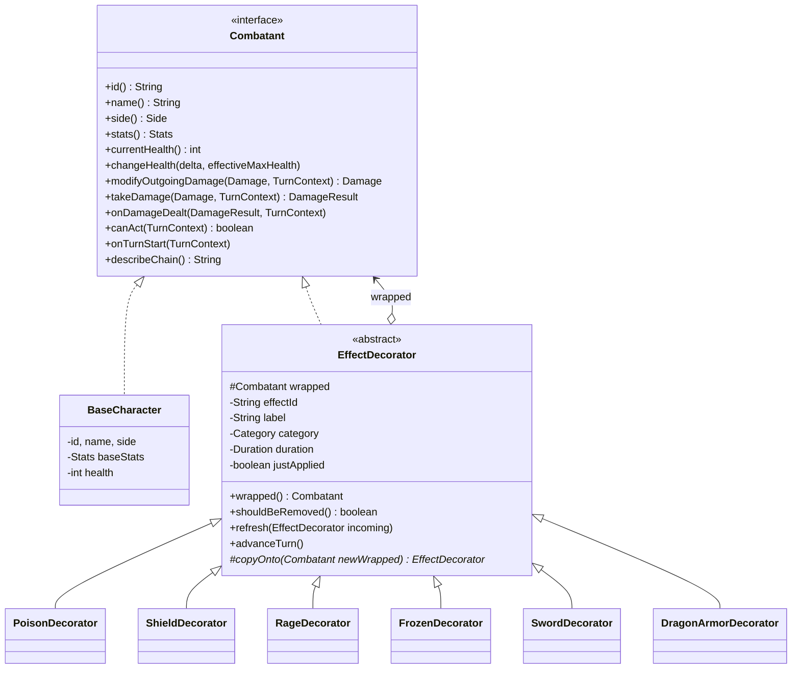

# Diseño — RPG Decorator

> El **cómo** en detalle. Si algo aquí contradice a `requirements.md`, manda `requirements.md` y se reporta en `open-questions.md`.
> **Código en inglés** (ADR-004). Los textos visibles para el jugador (`label`, `name`, `description` de los catálogos) van en español. Ver `glossary.md`.

Índice:
1. Mapa del patrón Decorator
2. Contratos del dominio
3. Trampas del Decorator y cómo las resolvemos
4. Catálogos: efectos, equipo, clases y enemigos
5. Motor de combate y expedición
6. Eventos
7. Diseño de la UI

---

## 1. Mapa del patrón Decorator (GoF)

| Rol GoF | Clase | Paquete |
|---|---|---|
| **Component** | `Combatant` (interfaz) | `domain` |
| **ConcreteComponent** | `BaseCharacter` | `domain` |
| **Decorator** | `EffectDecorator` (abstracta) | `domain.decorator` |
| **ConcreteDecorator** (temporales) | `PoisonDecorator`, `ShieldDecorator`, `RageDecorator`… | `domain.effects` |
| **ConcreteDecorator** (permanentes) | `SwordDecorator`, `DragonArmorDecorator`… | `domain.equipment` |
| **Client** | `CombatEngine`, `EffectManager` | `engine` |



Ejemplo de cadena en memoria (afuera → adentro):

```
hero ──► RageDecorator ──► PoisonDecorator ──► SwordDecorator ──► BaseCharacter(warrior)
         (temporal, 2t)    (temporal, 3t)      (equipo, ∞)        (vida, stats base)
describeChain() = "Furia(Envenenado(Espada(Guerrero)))"   ← usa los labels en español (texto visible)
```

**Invariante de orden:** el equipo siempre queda **por dentro** de los efectos temporales: se aplica al crear el combate, antes de cualquier efecto, y los efectos nuevos se agregan siempre en la capa exterior.

---

## 2. Contratos del dominio

### 2.1 Tipos de valor (records)

```java
record Stats(int maxHealth, int attack, int defense, int speed, int critChance) // critChance = % 0..100
    // withAttack(int), withDefense(int)... return copies

record Damage(int physical, int elemental, String sourceId, boolean critical, boolean reflectable)
    // physical: mitigated by defense; elemental: NOT mitigated

record DamageResult(int taken, int absorbed, int reflected, boolean evaded)
    // taken = health actually lost; reflected = damage to send back to the attacker

enum Side { HERO, ENEMY }
enum Category { EQUIPMENT, BUFF, DEBUFF, CONTROL }   // EQUIPMENT = permanente, no se purga
enum DamageType { PHYSICAL, ELEMENTAL, POISON, REFLECTED }
record Duration(int turns) // PERMANENT = Integer.MAX_VALUE; decrement(), isExpired()
```

### 2.2 `Combatant` — semántica de cada método

| Método | `BaseCharacter` | `EffectDecorator` (por defecto) |
|---|---|---|
| `id()`, `name()`, `side()` | Valores propios | Delega (la identidad es la del base) |
| `stats()` | `baseStats` | Delega. Los decoradores de stats transforman `wrapped.stats()` |
| `currentHealth()` | `health` | Delega |
| `changeHealth(delta, max)` | `health = clamp(health + delta, 0, max)` | Delega. **Ningún decorador lo sobrescribe** |
| `modifyOutgoingDamage(d, ctx)` | Devuelve `d` | Delega |
| `takeDamage(d, ctx)` | Resta `d` a la vida y devuelve el resultado | Delega |
| `onDamageDealt(r, ctx)` | No hace nada | Delega |
| `canAct(ctx)` | `true` | Delega |
| `onTurnStart(ctx)` | No hace nada | **Primero su lógica, luego delega** |
| `describeChain()` | `label` de la clase o enemigo | `label + "(" + wrapped.describeChain() + ")"` |

Cada decorador concreto **sobrescribe solo lo que le corresponde** y en todo lo demás delega (lo hereda de `EffectDecorator`).

### 2.3 `TurnContext` (interfaz en `domain`, implementada por `engine`)

Los decoradores **no mutan la vida directamente**: piden al contexto que lo haga, y el motor lo resuelve con la **cadena exterior** (ver §3.1).

```java
interface TurnContext {
    void emit(CombatEvent event);
    RandomSource random();
    void directDamage(String targetId, int amount, DamageType type, String sourceEffectId); // ignores defense and shield
    void heal(String targetId, int amount, String sourceEffectId);
    int round();
}

interface RandomSource {
    int nextInt(int minInclusive, int maxInclusive);
    boolean chance(int percent);   // true with probability percent/100
}
```

> `TurnContext`, `RandomSource` y `CombatEvent` viven en `domain` (los decoradores los usan); `engine` e `infrastructure` los implementan. Esto respeta la regla `engine → domain`.

### 2.4 `EffectDecorator`

```java
public abstract class EffectDecorator implements Combatant {
    protected final Combatant wrapped;
    private final String effectId;     // "poison", "sword"...
    private final String label;        // "Envenenado", "Espada"  (UI text)
    private final Category category;
    private Duration duration;
    private boolean justApplied = true;

    // ... delegates EVERY Combatant method to `wrapped` ...

    public Combatant wrapped();
    public boolean shouldBeRemoved()            { return duration.isExpired(); }        // Shield: || absorption == 0
    public void refresh(EffectDecorator incoming) { this.duration = incoming.duration; } // Shield: adds absorption
    public void advanceTurn() { if (justApplied) justApplied = false; else duration = duration.decrement(); }

    /** Copies this decorator (with its state: duration, absorption...) on top of another combatant. */
    protected abstract EffectDecorator copyOnto(Combatant newWrapped);
}
```

---

## 3. Trampas del Decorator y cómo las resolvemos

> Esta sección es **el corazón didáctico** del proyecto. Cada trampa tiene su test (T-108).

### 3.1 Llamadas a sí mismo (*self-calls*) ignoran los decoradores
`BaseCharacter` no sabe que está decorado: si dentro de sí mismo usara `this.stats().defense()`, vería la defensa **sin** la armadura.
**Solución:** todo cálculo que necesita stats efectivas lo hace **el motor sobre la referencia exterior**:
- La mitigación por defensa la calcula `DamageCalculator` con `target.stats()` **antes** de llamar a `takeDamage`.
- La vida máxima efectiva se pasa como parámetro: `changeHealth(delta, outer.stats().maxHealth())`.
- Los decoradores curan o dañan vía `TurnContext`, que resuelve la cadena exterior por `id`.

### 3.2 Quitar un decorador del medio
Las referencias `wrapped` son `final`; no se puede "desenganchar" una capa.
**Solución (ADR-002):** `EffectManager` **reconstruye** la cadena:
1. Desenrolla de afuera hacia adentro: `[Rage, Poison, Sword]` + `base`.
2. Filtra las capas a retirar → `[Rage, Sword]`.
3. Reenvuelve de adentro hacia afuera con `copyOnto`: `base → Sword' → Rage'`.
4. Devuelve la nueva referencia exterior; `Combat` la reemplaza.

El `BaseCharacter` es **la misma instancia**, así que la vida se conserva. Las capas copiadas conservan su estado (turnos, absorción).

### 3.3 `instanceof` deja de funcionar
`hero instanceof FrozenDecorator` solo ve la capa exterior.
**Solución:** `EffectManager.hasEffect(c, "frozen")` y `EffectManager.layers(c)` recorren la cadena. Nadie fuera de `EffectManager` hace `instanceof` sobre decoradores.

### 3.4 El orden importa
`Rage(Sword(base))`: attack = (14 + 6) × 1.5 = **30**.
`Sword(Rage(base))`: attack = 14 × 1.5 + 6 = **27**.
**Solución:** el orden lo fija la invariante del §1 (equipo dentro, efectos fuera, en orden de aplicación). El inspector muestra las **stats en cada capa** para que se vea.

### 3.5 Duplicados
Aplicar dos veces Poison crearía `Poison(Poison(...))` y doble daño.
**Solución:** `EffectManager.apply` busca el `effectId` en la cadena; si ya existe, llama a `refresh` (RF-16) y emite `EFFECT_REFRESHED`.

### 3.6 Identidad
`equals`/`id` entre capas: todas las capas devuelven el `id()` del base. Los repositorios y el contexto buscan por `id`, nunca por referencia.

---

## 4. Catálogos

### 4.1 Fórmulas (`DamageCalculator`)
- **Daño bruto:** `round(attacker.stats().attack() × multiplier)`. Ataque normal: multiplicador 1.0.
- **Crítico:** con probabilidad `critChance %` → bruto × 1.5 (redondeo hacia abajo).
- **Daño saliente:** `attacker.modifyOutgoingDamage(new Damage(raw, 0, …))` (el FireRing suma elemental aquí).
- **Evasión:** probabilidad `min(25, target.speed × 2) %` → evento `EVADED`, sin daño.
- **Mitigación:** `physical' = max(1, physical − target.stats().defense() / 2)`; `elemental` no se mitiga.
- Luego `target.takeDamage(mitigated)` → `DamageResult`.
- Si `reflected > 0` → `ctx.directDamage(attacker, reflected, REFLECTED)`; el daño reflejado **no** se vuelve a reflejar.
- Finalmente `attacker.onDamageDealt(result)` (Lifesteal).
- Todos los porcentajes se redondean hacia abajo; los efectos que curan o dañan lo hacen con un mínimo de 1 si su base es > 0.

### 4.2 Efectos temporales (`EffectCatalog`)

| id | label (UI) | Category | Duración | Comportamiento (método sobrescrito) |
|---|---|---|---|---|
| `poison` | Envenenado | DEBUFF | 3 | `onTurnStart`: `directDamage(6, POISON)` |
| `regeneration` | Regeneración | BUFF | 3 | `onTurnStart`: `heal(8)` |
| `shield` | Escudo | BUFF | 3 | `takeDamage`: absorbe hasta `absorption` (20) y delega el resto. Se retira si `absorption == 0` |
| `thorns` | Espinas | BUFF | 3 | `takeDamage`: delega y pone `reflected = 30 %` de `taken` (si `damage.reflectable`) |
| `rage` | Furia | BUFF | 2 | `stats()`: attack × 1.5, defense × 0.7 |
| `guard` | En guardia | BUFF | 1 | `stats()`: defense × 1.5 |
| `frozen` | Congelado | CONTROL | 1 | `canAct()`: `false` (no delega) |
| `lifesteal` | Vampirismo | BUFF | 3 | `onDamageDealt`: `heal(30 % de taken)` |

**Silence** **no es un decorador**: es una **operación sobre la cadena** (`EffectManager.purge`) que retira todas las capas con categoría ≠ `EQUIPMENT`. Es un buen ejemplo de qué *no* modelar como decorador.

### 4.3 Reaplicación (RF-16)
- Por defecto: la duración se **resetea** al valor del nuevo efecto.
- `shield`: suma la absorción (`min(40, current + 20)`) y resetea la duración.

### 4.4 Reglas de interacción (`InteractionRules`, RF-17)
Se evalúan **antes** de aplicar el efecto nuevo:

| Al aplicar | Se retira | Motivo |
|---|---|---|
| `frozen` | `rage` | No se puede estar furioso congelado |
| `rage` | `guard` | La furia rompe la guardia |
| `poison` | `regeneration` | Se anulan |
| `regeneration` | `poison` | Se anulan |

Las reglas son **datos** (una tabla `Map<String, Set<String>>`), no `if` dispersos: agregar una regla no toca el motor (RNF-03).

### 4.5 Duración y `justApplied`
- La duración cuenta **turnos del combatiente afectado**.
- `EffectManager.advanceTurn(c)` se llama al **final del turno** del afectado: decrementa la duración de cada capa y luego retira las que `shouldBeRemoved()`.
- Un efecto aplicado **durante el propio turno del afectado** (p. ej., Rage sobre uno mismo) no decrementa ese turno (`justApplied`), así dura N turnos completos.
- Ejemplo: Poison (3) aplicado por el enemigo → el héroe recibe daño al inicio de sus 3 turnos siguientes y luego se retira.

### 4.6 Equipo (`EquipmentCatalog`) — decoradores permanentes

| id | name (UI) | Slot | Efecto |
|---|---|---|---|
| `sword` | Espada | WEAPON | attack +6 |
| `war_axe` | Hacha de guerra | WEAPON | attack +10, speed −3 |
| `rune_staff` | Bastón rúnico | WEAPON | attack +3, critChance +15 |
| `leather_armor` | Armadura de cuero | ARMOR | defense +4 |
| `dragon_armor` | Armadura de dragón | ARMOR | defense +10, speed −4 |
| `fire_ring` | Anillo de fuego | ACCESSORY | `modifyOutgoingDamage`: elemental +4 |
| `life_amulet` | Amuleto de vida | ACCESSORY | maxHealth +25 |
| `wind_boots` | Botas de viento | ACCESSORY | speed +5 |

Máximo una pieza por slot (RF-02). Las stats nunca bajan de 0 (critChance tope 100).

### 4.7 Clases de héroe (`HeroClassCatalog`)

| id | name (UI) | HP | Atk | Def | Spd | Crit | Habilidad 1 | Habilidad 2 |
|---|---|---|---|---|---|---|---|---|
| `warrior` | Guerrero | 120 | 14 | 8 | 4 | 10 | `war_cry` "Grito de guerra": rage a sí mismo (cd 3) | `shield_wall` "Muro de escudos": shield a sí mismo (cd 3) |
| `mage` | Mago | 80 | 18 | 4 | 6 | 10 | `ice_bolt` "Rayo de hielo": daño ×0.8 + frozen al rival (cd 4) | `arcane_silence` "Silencio arcano": purga al rival (cd 4) |
| `archer` | Arquero | 95 | 15 | 5 | 10 | 20 | `poison_arrow` "Flecha envenenada": daño ×0.7 + poison al rival (cd 3) | `vampiric_arrow` "Flecha vampírica": lifesteal a sí mismo + daño ×1.0 (cd 4) |

```java
record Ability(String id, String name, String description, int cooldown,
               double damageMultiplier,                // 0 = does not attack
               List<EffectApplication> effects,        // (effectId, Target.SELF | OPPONENT)
               boolean purgesOpponent)                 // silence
```
Orden de resolución de una habilidad: 1) efectos sobre uno mismo, 2) daño (si el multiplicador es > 0), 3) efectos sobre el rival (solo si el golpe no fue evadido), 4) purga.

### 4.8 Enemigos (`EnemyCatalog`) e IA

| Nivel | id | name (UI) | HP | Atk | Def | Spd | Crit | Habilidades (en orden de prioridad) |
|---|---|---|---|---|---|---|---|---|
| 1 | `goblin` | Goblin | 70 | 11 | 3 | 8 | 10 | `dirty_dagger` "Daga sucia": daño ×0.8 + poison al rival (cd 3; 50 % de probabilidad si está lista) |
| 1 | `wolf` | Lobo | 60 | 12 | 2 | 12 | 15 | `howl` "Aullido": rage propia (cd 4; si HP < 60 %) |
| 1 | `slime` | Slime | 90 | 8 | 4 | 2 | 0 | `jelly_shield` "Gelatina": shield propio (cd 4) · `acid_spit` "Ácido": daño ×0.5 + poison (cd 3) |
| 2 | `skeleton` | Esqueleto | 100 | 13 | 7 | 3 | 5 | `reassemble` "Reensamblar": regeneration propia (cd 5; si HP < 50 %) · `sharp_bones` "Huesos afilados": thorns propias (cd 4) |
| 2 | `orc_shaman` | Orco chamán | 110 | 14 | 6 | 5 | 10 | `curse` "Maldición": purga al rival (cd 5; si el rival tiene ≥ 2 efectos BUFF) · `blood_totem` "Tótem de sangre": lifesteal propio (cd 4) |
| 3 | `stone_golem` | Golem de piedra | 160 | 15 | 14 | 1 | 0 | `stone_skin` "Piel de piedra": thorns propias (cd 4) · `stomp` "Pisotón": daño ×1.0 + frozen (cd 5) |
| 3 | `witch` | Bruja | 90 | 16 | 4 | 7 | 15 | `potion` "Pócima": regeneration propia (cd 4; si HP < 50 %) · `frost_hex` "Hechizo gélido": frozen al rival (cd 4) · `hex` "Maleficio": poison al rival (cd 3) |
| 4 (jefe) | `dragon` | Dragón | 200 | 17 | 9 | 5 | 10 | `scales` "Escamas": shield propio (cd 5; si HP < 40 %) · `frost_breath` "Aliento helado": daño ×0.6 + frozen (cd 5) · `roar` "Rugido": rage propia (cd 4) |

Cada enemigo **demuestra decoradores distintos**, así la expedición recorre todo el catálogo de efectos.

**IA (`EnemyAI`):** recorre las habilidades en orden de prioridad; usa la primera que tenga cooldown 0 **y** cumpla su condición. Si ninguna aplica → `Attack`. Determinista salvo por las probabilidades, que usan `RandomSource`.

---

## 5. Motor de combate y expedición

### 5.1 Agregado `Combat`
```
Combat { id, status, round,
         Combatant hero, Combatant enemy,                  // OUTER references
         Map<String,Integer> heroCooldowns, enemyCooldowns,
         List<CombatEvent> log, int eventSequence }
```
Toda mutación ocurre dentro de `synchronized` sobre la expedición dueña del combate.

### 5.2 Acciones
```java
sealed interface Action permits Attack, Defend, UseAbility, Pass {}
```
- `Defend` → aplica `guard` a sí mismo.
- `Pass` → solo es válida si el héroe **no** puede actuar (frozen); la UI la ofrece en ese caso.
- Validaciones → `InvalidActionException` con su código de error (habilidad inexistente, en cooldown, combate terminado).

### 5.3 Algoritmo de una ronda (`CombatEngine.executeRound`)
```
executeRound(combat, heroAction):
    validate(combat, heroAction)
    takeTurn(HERO, heroAction)
    if enemy.health == 0 → finish(VICTORY); return
    takeTurn(ENEMY, ai.decide(combat))
    if hero.health == 0 → finish(DEFEAT); return
    combat.round++

takeTurn(actor, action):
    emit TURN_STARTED
    decrement actor cooldowns > 0
    actor.onTurnStart(ctx)                    # poison, regeneration
    if actor.health == 0 → emit DEATH; return
    if !actor.canAct(ctx) → emit TURN_SKIPPED
    else → resolve(action)                    # §4.1 and §4.7; sets the used ability's cooldown
    actor = effectManager.advanceTurn(actor)  # durations; removes expired → EFFECT_REMOVED
    emit TURN_ENDED
```
> La referencia exterior del actor **puede cambiar** durante el turno (al aplicar o retirar capas): el motor siempre relee `combat.hero()` / `combat.enemy()` después de cada operación del gestor.

### 5.4 `EffectManager` — API

```java
Combatant apply(Combatant outer, String effectId, TurnContext ctx);                    // rules → refresh or wrap
Combatant remove(Combatant outer, Predicate<EffectDecorator> filter, RemovalReason reason, TurnContext ctx);
Combatant advanceTurn(Combatant outer, TurnContext ctx);                               // decrement + remove (EXPIRED/DEPLETED)
Combatant purge(Combatant outer, TurnContext ctx);                                     // silence
Combatant equip(BaseCharacter base, Collection<String> equipmentIds);                  // only when an encounter starts
boolean hasEffect(Combatant outer, String effectId);
List<Layer> layers(Combatant outer);   // outer → inner, with effective stats at each layer
```

### 5.5 Expedición (`Expedition`, `ExpeditionService`)

```
Expedition { id, seed, heroClassId,
             status: IN_PROGRESS | AWAITING_REWARD | COMPLETED | FAILED,
             currentLevel (1..4), List<String> enemyIdsByLevel,     // drawn at creation
             BaseCharacter heroBase,                                // SAME instance across all encounters
             Map<Slot, String> equipment,                           // current pieces
             Combat currentCombat, List<String> offeredRewards,
             RunStatistics statistics }                             // defeated, rounds, damage dealt and taken
```

Ciclo de vida:
```
create(heroClassId, startingItemId, seed?)
   → EnemyDraw picks one enemy per level with RandomSource(seed)
   → heroBase = new BaseCharacter(heroClass); health = effective maxHealth with equipment
   → startEncounter(1)

startEncounter(n):
   hero  = effectManager.equip(heroBase, equipment.values())   # NEW chain: equipment only, no effects
   enemy = new BaseCharacter(enemyIdsByLevel[n])
   currentCombat = new Combat(hero, enemy)

when currentCombat ends:
   DEFEAT              → status = FAILED
   VICTORY and n == 4  → status = COMPLETED
   VICTORY and n < 4   → heal 30 % of effective maxHealth (RF-24)
                         offeredRewards = RewardDraw: 3 random, distinct, not equipped
                         status = AWAITING_REWARD

chooseReward(itemId | null):
   if itemId → equipment[slot(item)] = itemId       # replaces
   currentLevel++ ; startEncounter(currentLevel) ; status = IN_PROGRESS
```

> **Por qué así se purgan los efectos (RF-24):** al iniciar cada encuentro se **reconstruye la cadena desde el `BaseCharacter`** solo con el equipo. Los efectos temporales del encuentro anterior simplemente no se vuelven a envolver. El base (y por tanto la vida) es la misma instancia.

---

## 6. Eventos (`CombatEvent`, sealed)

Todo evento tiene `seq` (incremental por combate), `round` y `type`. Campos específicos:

| type | Campos | Animación en la UI |
|---|---|---|
| `TURN_STARTED` | `actorId` | Resalta la tarjeta del actor |
| `ACTION` | `actorId`, `action`, `abilityId?` | Texto "¡Grito de guerra!" sobre el actor |
| `DAMAGE` | `targetId`, `amount`, `damageType` (PHYSICAL, ELEMENTAL, POISON, REFLECTED), `critical` | Número rojo flotante + sacudida (morado si es veneno, naranja si es elemental) |
| `EVADED` | `targetId` | Texto "¡Esquivó!" + desplazamiento lateral |
| `ABSORBED` | `targetId`, `amount`, `remaining` | Número azul + destello del escudo |
| `HEAL` | `targetId`, `amount`, `sourceEffectId` | Número verde flotante |
| `EFFECT_APPLIED` | `targetId`, `effectId`, `duration` | El ícono entra a la lista con *pop*; capa nueva en el inspector |
| `EFFECT_REFRESHED` | `targetId`, `effectId`, `duration` | El ícono pulsa |
| `EFFECT_REMOVED` | `targetId`, `effectId`, `reason` (EXPIRED, DEPLETED, PURGED, INTERACTION) | El ícono se desvanece; la capa sale del inspector |
| `TURN_SKIPPED` | `actorId`, `effectId` | Overlay de hielo + aviso |
| `DEATH` | `combatantId` | Retrato en gris, se cae |
| `TURN_ENDED` | `actorId` | — |
| `COMBAT_ENDED` | `result` (VICTORY, DEFEAT) | Banner de victoria o derrota; luego transición a Reward o Summary |

---

## 7. Diseño de la UI

> Nombres de componentes y archivos en inglés; **textos en pantalla en español**.

### 7.1 Pantallas y navegación
```
[ClassSelect] ─► [Loadout: pieza inicial] ─► [Map] ─► [Arena] ─┬─ victoria ─► [Reward] ─► [Map] ─► ...
                                                               └─ derrota / jefe vencido ─► [Summary]
[Summary] ── "Nueva expedición" ─► [ClassSelect]
```
Navegación por estado en Zustand (`screen`), sin router. La pantalla se **deriva** del `status` de la expedición que devuelve el backend:
`IN_PROGRESS` → Arena (o Map si el combate aún no empezó, `round == 1` sin eventos) · `AWAITING_REWARD` → Reward · `COMPLETED` / `FAILED` → Summary.

### 7.2 `ClassSelectScreen`
Tres tarjetas de clase: retrato, stats en barras y las 2 habilidades con su descripción.

### 7.2.b `MapScreen`
```
  [1 Goblin ✔] ─── [2 ???] ─── [3 ???] ─── [4 🐉 Dragón]
                     ▲ estás aquí
  Vida 68/95 · Cadena: Espada(Arquero)          [ Entrar al combate ]
```
Los niveles vencidos muestran el enemigo con ✔; el siguiente se revela al llegar a él.

### 7.2.c `RewardScreen`
Tres tarjetas de pieza (slot, bonus). Al pasar el mouse por una: **vista previa** de la cadena y las stats resultantes (`POST /api/preview`), resaltando la pieza que se reemplazaría. Botones "Elegir" y "Omitir".

### 7.2.d `SummaryScreen`
Resultado (COMPLETED / FAILED), enemigos vencidos, rondas, daño infligido y recibido, y la cadena final de equipo. Botón "Nueva expedición".

### 7.3 `LoadoutScreen` (pieza inicial)
Se elige **1 pieza** (RF-02); el componente `Inventory` se reutiliza en `RewardScreen`.
```
┌─────────────────────────────┬─────────────────────────────────────┐
│  INVENTARIO (arrastrables)  │      [ retrato del héroe ]          │
│  🗡 Espada   🪓 Hacha        │   ┌ARMA┐   ┌ARMADURA┐  ┌ACCESORIO┐  │
│  🛡 Cuero    🐉 Dragón       │   └────┘   └────────┘  └─────────┘  │
│  💍 Anillo   📿 Amuleto      │   Stats: Atq 14 → 20 (+6) ...       │
│  👢 Botas                   │   Cadena: Espada(Guerrero)          │
└─────────────────────────────┴─────────────────────────────────────┘
```
- dnd-kit: solo se puede soltar en el slot correcto (se ilumina en verde o rojo).
- Cada cambio llama a `POST /api/preview` (con *debounce* de 200 ms) → stats y cadena calculadas por el backend (RF-03).

### 7.4 `ArenaScreen` (pantalla principal)
```
┌──────────────────────────────────────────────────────────────────────┐
│ Nivel 2/4 · Esqueleto · Ronda 3                         [⚙ inspector] │
├────────────────────────────┬─────────────────────────────────────────┤
│  HÉROE                     │                         ENEMIGO         │
│  [retrato]  ███████░░ 84/120│ 112/180 ██████░░░  [retrato]            │
│  Atq 30 Def 6 Vel 4        │        Atq 17 Def 9 Vel 5               │
│  [🔥Furia 2] [☠Veneno 1]    │        [🛡Escudo 2 · 15]                 │
├────────────────────────────┴─────────────────────────────────────────┤
│  INSPECTOR DE CADENA (héroe)          │  LOG DE COMBATE              │
│  ┌ Furia        BUFF  2t  Atq 30 ┐    │  R3 Guerrero usa Grito…      │
│  │┌ Envenenado DEBUFF 1t  Atq 20 ┐│   │  R3 Esqueleto recibe 21 (crít)│
│  ││┌ Espada     EQUIPO ∞ Atq 20 ┐││   │  R3 Escudo absorbe 8         │
│  │││ Guerrero (base)   Atq 14  │││   │  ...                         │
│  Furia(Envenenado(Espada(Guerrero)))  │                              │
├───────────────────────────────────────┴──────────────────────────────┤
│ [⚔ Atacar] [🛡 Defender] [Grito de guerra (cd 2)] [Muro de escudos]   │
└──────────────────────────────────────────────────────────────────────┘
```
- **`ChainInspector`** (★ RF-20): cajas anidadas (afuera → adentro) con categoría, turnos y stats **en esa capa**; las capas entran y salen animadas con `AnimatePresence`. Pestañas Héroe / Enemigo.
- **`ActionPanel`**: deshabilitado mientras se reproducen los eventos o si el combate terminó. Habilidades en cooldown: gris con el número de turnos. Si el héroe está frozen: solo "Pasar turno".
- En móvil: columnas apiladas; el inspector y el log van en pestañas.

### 7.5 Estilo visual
- Tema oscuro de "fantasía": tokens en `styles/tokens.css` (`--color-bg`, `--color-panel`, `--color-border`, `--color-text`, `--color-health`, `--color-damage`, `--color-heal`, `--color-shield`, `--color-poison`, `--color-frost`, `--color-fire`, `--color-equipment`, `--color-buff`, `--color-debuff`, `--color-control`).
- Color por categoría de efecto: EQUIPMENT gris-dorado, BUFF verde, DEBUFF morado, CONTROL celeste.
- Tipografía: una serif de fantasía para títulos (Google Fonts, p. ej. *Cinzel*) y una sans para datos.

### 7.6 Animación
- `eventPlayer` consume la cola en orden, unos 600 ms por evento (DAMAGE o HEAL: 700 ms; TURN_STARTED: 300 ms).
- Botón "⏩ Rápido" (×3) y respeto de `prefers-reduced-motion` (sin sacudidas ni desplazamientos; solo cambios de opacidad).
- Al vaciarse la cola se pinta la `expedition` final recibida del servidor.

### 7.7 Accesibilidad
- Barras de vida con `role="progressbar"` y `aria-valuenow`.
- `CombatLog` es una región `aria-live="polite"`.
- Se puede jugar solo con teclado: `1` Atacar, `2` Defender, `3`/`4` Habilidades.
